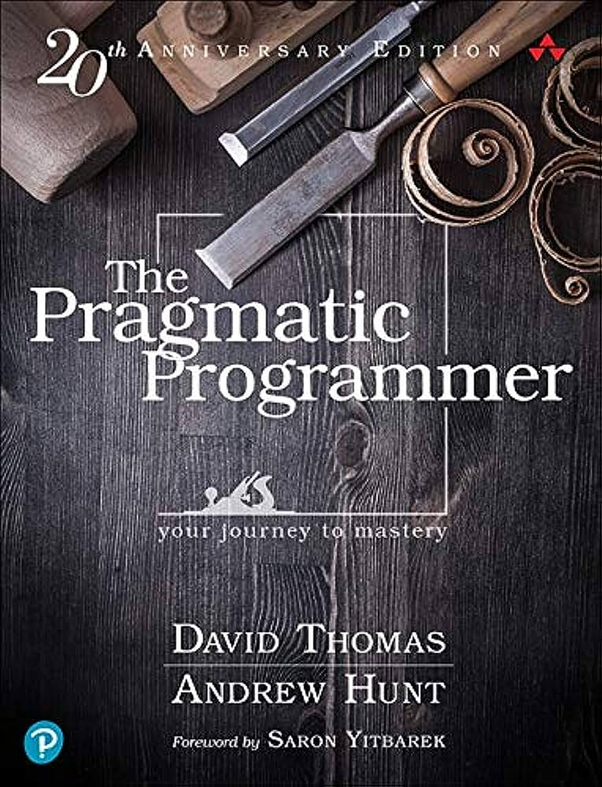
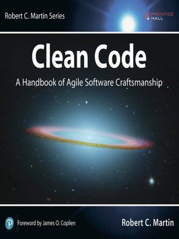

Hi, I'm Michael!
==============================
I'm a Software Craftsman with 15 years of experience in the industry.

## Key Proficiency: Back-end Service Engineering

## Key Proficiency: Front-end Development

## Key Proficiency: Functional and Declarative Paradigms ##

## Key Proficiency: AI, Machine Learning, and Data Science ##

## Q&A ##

### Why do you consider yourself a software craftsman? ###

## Books ##
Some books that have helped me become a better Software Engineer and Craftsman 
over the years.  I recommend them to engineers at all levels of experience.

* *[The Pragmatic Programmer: Your Journey to Mastery](https://pragprog.com/titles/tpp20/the-pragmatic-programmer-20th-anniversary-edition/)*, by David Thomas and Andrew Hunt
* *[Clean Code: A Handbook of Agile Software Craftsmanship](https://www.oreilly.com/library/view/clean-code-a/9780136083238/)*, by Robert C. Martin
* *[Clean Architecture: A Craftsman's Guide to Software Structure and Design](https://www.oreilly.com/library/view/clean-architecture-a/9780134494272/)*, by Robert C. Martin

## Professional Background in brief ##
* Foundational Full-Stack Experience (2008 - 2014)
  * Entered the software field as a Web Developer in 2008
  * Gained broad experience developing back-end services with Java/Spring, Python/Django, PHP, SQL, and NoSQL
  * Front-end experience modernising UX with HTML5, CSS3, JS
* Senior Engineer and Leader (Since 2014)
  * Senior Software Engineer work primarily on Enterprise-scale back-end services with Java/Kotlin/Spring Boot and C#/.NET Core; also, front-end UX using ES6, Typescript, Angular, and React
  * Served as Agile/Scrum Master, Dev Team Leader, Project architect
  * Continue to learn from other brilliant engineers, having had the chance to work on proficient and pragmatic engineering teams

## Projects ##
While I can't include my best work on a public platform, I'll continue to add samples of my public work here as a work-in-progress.

### Code Samples ###
These Advent of Code solutions are a fun diversion. These repositories contain a handful of samples demonstrating how I like to interact with code challenges at a tactical level.
* [AoC 2022](https://github.com/engineerclark/advent-of-code-2022/)
* [AoC 2021](https://github.com/engineerclark/advent-of-code-2021/)

## Tech Proficiencies ##
### Current Daily Toolkit ###
* Back-end: Java, Kotlin, Spring Boot, SQL, MongoDB
* Front-end: Typescript
* Cloud: Kubernetes, AWS, Docker
* CI/CD: Git/Github, Jenkins, Docker builds, Automated unit/integration/e2e testing with frameworks such as JUnit, Protractor JS, and selenium
* Scripts/CLI: Python 3, KTS, bash, zsh
* IDEs/Editors: IntelliJ IDEA, VS Code, vim

### Other Extensive Experience (5+ years) ###
* Back-end: C#, .NET Core, ASP.NET MVC, Python, Django
* Front-end: Typescript, ES6, Angular, React, HTML5, CSS3, Sass
* Scripting: Powershell
* Linux: Server administration, WSL2

